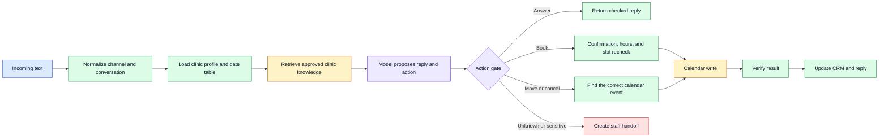

# Clinic AI Front Desk: Case Study

How I built an AI receptionist that changes a real clinic calendar without a human
approving each write.

The replies were not the hard part. The hard part was guaranteeing it never
double-books, never picks the wrong patient when two people share a phone number,
and never invents a clinic policy.

> **Engineering write-up. No runnable code.** The production workflow stays private.
> For a working template of the same architecture, see
> [Dental AI Front Desk](https://github.com/a3s5jj/dental-ai-frontdesk-oss).

## Problem

A useful front desk needs to do more than produce a friendly reply. It must keep
weekdays and dates aligned, distinguish people who share a phone number, avoid double
bookings, refuse unsupported medical claims, preserve the calendar as the source of
truth, and tell staff when automation has reached its limit.

## How it works

The system turns a text inquiry into one of four controlled outcomes: answer from
approved clinic information, collect booking details, perform a confirmed calendar
change, or create a staff handoff. Calendar and CRM writes are deterministic. The
language model never writes to those systems directly.

## Key decisions

- The model proposes intent. Deterministic workflow branches authorize writes.
- A generated 14-day date table replaces mental weekday arithmetic.
- Event IDs, not phone numbers, are the stable key for booking rows.
- The workflow checks a slot when it offers one, then again immediately before
  creating it.
- The patient must confirm the exact booking, move, or cancellation.
- Retrieval silence means unknown, not no. Unsupported facts go to staff.
- A completion message is built only after the external write returns success.

## Safeguards

- no diagnosis, prescriptions, medication dosing, or promised outcomes
- explicit handoff for urgent, sensitive, unsupported, or requested human review
- mobile-number normalization without guessing missing digits
- ambiguous shared-number matches stop for a name instead of choosing a person
- booking-hour checks apply to both start and end time
- reschedule conflict checks exclude the appointment being moved
- CRM updates preserve trusted booking-time fields during later changes
- workflow exports remain inactive until account-specific checks are complete

## Verification

I reran the private implementation deterministic suites on 2026-09-02, before writing
this case study.

| Suite | Result |
|---|---:|
| Appointment matching | 18 / 18 |
| Clinic hours | 15 / 15 |
| Reply and language handling | 18 / 18 |
| Rebooking guard | 88 / 88 |
| Confirmation gate | 123 / 123 |
| Post-booking status | 54 / 54 |
| Simplified workflow behavior | 74 / 74 |
| Workflow layout | 104 / 104 |

Structural validation also passed.

## What is publicly available

- [Architecture and trust boundaries](docs/architecture.md)
- [Failures and engineering lessons](docs/failures-and-lessons.md)
- [Verification boundary](docs/verification.md)

## Scope and limits

These results support the architecture described here. They do not make this
repository runnable and do not prove a public deployment. No patient transcript,
clinic knowledge base, calendar ID, credential, private URL, execution export,
database, backup, or production workflow is included.

- This repository cannot be installed or activated. It intentionally contains no
  production workflow.
- External-provider behavior still needs account-owned integration testing.
- Language-model responses can vary even when write guards are deterministic.
- Clinical, privacy, and records obligations depend on the deployment jurisdiction.
- No conversion, cost, uptime, or response-time number is claimed here.

## Copyright

Copyright (c) 2026 AJ. All rights reserved. See [LICENSE.md](LICENSE.md).
