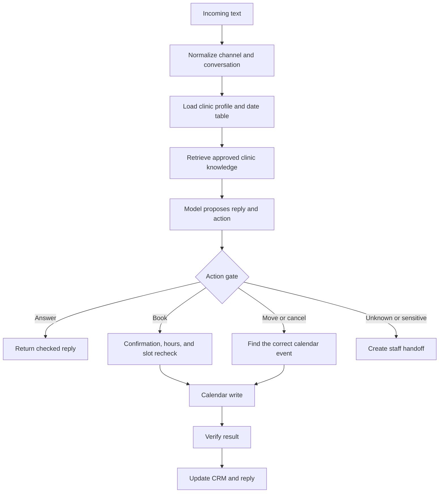

# Clinic AI Front Desk: Case Study

`CASE_STUDY_ONLY` · `OFFLINE_VERIFIED` · production workflow withheld

This case study explains how a dental front desk was designed around safe booking
changes, clinic-owned knowledge, and visible failure handling. It documents the
engineering decisions and the tests without publishing a clinic workflow, account
configuration, patient data, or deployment history.

## Outcome

The system turns text inquiries into one of four controlled outcomes: answer from
approved clinic information, collect booking details, perform a confirmed calendar
change, or create a staff handoff. Calendar and CRM writes are deterministic; the
language model does not write to those systems directly.

## Problem

A useful front desk needs to do more than produce a friendly reply. It must keep
weekdays and dates aligned, distinguish people who share a phone number, avoid
double bookings, refuse unsupported medical claims, preserve the calendar as the
source of truth, and tell staff when automation has reached its limit.

## System flow

## Important decisions

- The model proposes intent; deterministic workflow branches authorize writes.
- A generated 14-day date table replaces mental weekday arithmetic.
- Event IDs, not phone numbers, are the stable key for booking rows.
- A slot is checked when offered and again immediately before creation.
- The patient must confirm the exact booking, move, or cancellation.
- Retrieval silence means “unknown,” not “no.” Unsupported facts go to staff.
- A completion message is built only after the external write returns success.

## Safeguards

- no diagnosis, prescriptions, medication dosing, or promised outcomes
- explicit handoff for urgent, sensitive, unsupported, or requested human review
- mobile-number normalization without guessing missing digits
- ambiguous shared-number matches stop for a name instead of choosing a person
- booking-hour checks apply to both start and end time
- reschedule conflict checks exclude the appointment being moved
- CRM updates preserve trusted booking-time fields during later changes
- workflow exports remain inactive until account-specific checks are complete

## Verification

The current private implementation's deterministic suites were rerun on
2026-09-02 before this case study was written:

| Suite | Result |
|---|---:|
| Appointment matching | 18 / 18 |
| Clinic hours | 15 / 15 |
| Reply and language handling | 18 / 18 |
| Rebooking guard | 88 / 88 |
| Confirmation gate | 123 / 123 |
| Post-booking status | 54 / 54 |
| Simplified workflow behavior | 74 / 74 |
| Workflow layout | 104 / 104 |

Structural validation also passed. These results support the architecture described
here; they do not make this repository runnable and do not prove a public deployment.

## Limitations

- This repository cannot be installed or activated. It intentionally contains no
  production workflow.
- External-provider behavior still needs account-owned integration testing.
- Language-model responses can vary even when write guards are deterministic.
- Clinical, privacy, and records obligations depend on the deployment jurisdiction.
- No conversion, cost, uptime, or response-time number is claimed here.

## What is publicly available

- [Architecture and trust boundaries](docs/architecture.md)
- [Failures and engineering lessons](docs/failures-and-lessons.md)
- [Verification boundary](docs/verification.md)

No patient transcript, clinic knowledge base, calendar ID, credential, private URL,
execution export, database, backup, or production workflow is included.

## Copyright

Copyright (c) 2026 AJ. All rights reserved. See [LICENSE.md](LICENSE.md).
